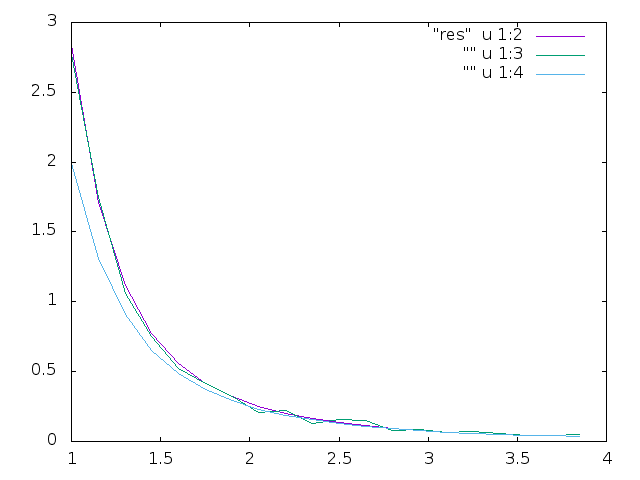

# Final 2
  Josh Pelton Dennis Scheglov

  Much like gravitation, the energy of interaction between two cubes of nonuniform charge density depends directly on the distance between them. To calculate the potential energy between them, a Monte Carlo expression was used to integrate. The first technique utilizes the GSL VEGAS Monte Carlo, the second was constructed by us, and the third technique used a dipole approximation. Errors and timing of each technique were documented and compared in charts, as well as the time it would take for our integrator to acheive the same level of accuracy as the professional GSL VEGAS Monte Carlo. The graph comparing each method is displayed below.

Special thanks to Filip Bergabo for assistance.
